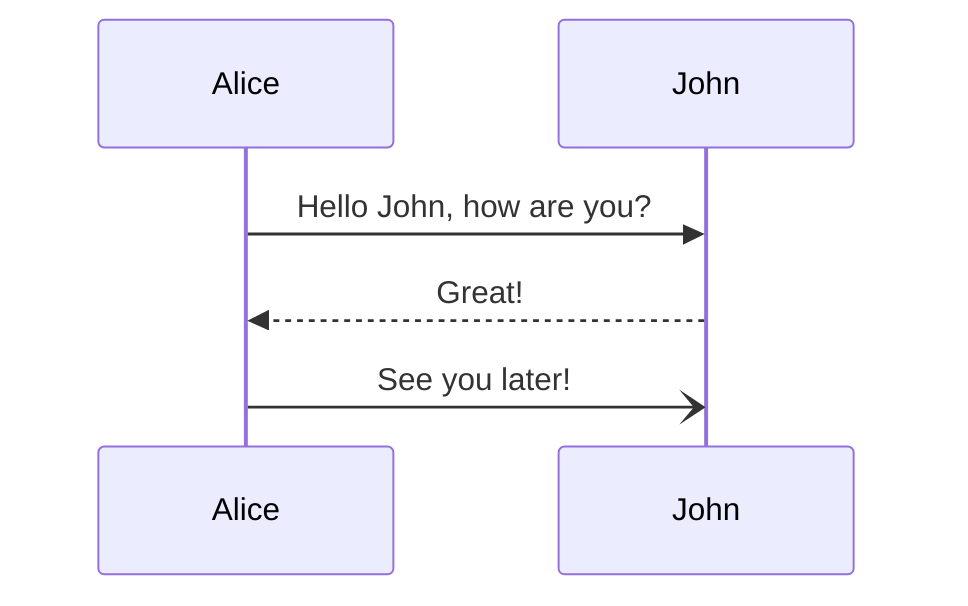

# mermaid-test



```mermaid
flowchart TD;
src(" preprod+prod
_(state#160; on#160; main#160; branch) _*")
dst1 ("'ga-a'")
src ->|‹a href='https://build.prod.pcln.com/api/v5/promote/overwrite/img+cfg/pipeline/demo-ak/src/preprod+prod/dst/qa-a/1v1/4'>IMAGE + CONFIG</a>| dst1
src ->|‹a href='https://build.prod.pcln.com/api/v5/promote/overwrite/cfg/pipeline/demo-ak/src/preprod+prod/dst/qa-a/lv1/4'>CONFIG</a>| dst1
dst2 ("'qa-b'")
```
